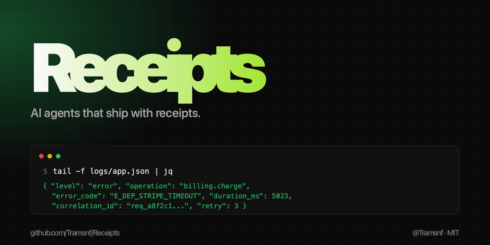

# Receipts



> **AI agents that ship with receipts.**
>
> Production observability and codebase memory for AI coding agents — a portable skill for **Claude Code, Cursor, Cline, Windsurf, Roo Code, and OpenHands** that forces structured logging, error taxonomies, change ledgers, debug maps, and incident logs on every change.

**Receipts** is a drop-in skill / `.cursorrules` / custom-instructions package that turns any AI coding agent into a Principal Reliability Engineer + Codebase Historian at the same time. It scans your repo, classifies each file's observability, maintains an append-only change ledger, propagates correlation IDs, enforces a stable error taxonomy, and treats missing logs and missing error handling as **production bugs — not nice-to-haves**.

Stop shipping vibe-coded apps that can't tell you what broke, when, or why.

---

## The problem

Vibe-coded apps don't come with receipts. They:

- have no audit trail
- have weak or missing logs
- silently swallow exceptions
- can't tell you what broke, when, or why
- fall apart the moment the original author moves on

Most AI-coded codebases fail for the same reason: the agent changes files without building a system map, there's no event trail, and nobody keeps a timeline of changes.

## The fix

Receipts forces any AI coding agent to behave like a **Principal Reliability Engineer + Codebase Historian** at the same time:

- scans the entire codebase before making changes
- classifies observability per file (fully / partially / minimally / not observable)
- enforces structured logging on every critical path
- enforces error handling at every failure boundary
- maintains an append-only **change ledger**
- maintains a **debug map** and **incident log**
- treats missing logs and missing error handling as production bugs

Works on existing repos (**remediation mode**) and new repos (**greenfield mode**).

---

## What it works with

**AI coding agents**: Claude Code (skill), Cursor (`.cursorrules`), Cline (custom instructions), Windsurf (`.windsurfrules`), Roo Code (custom modes), OpenHands (microagents), and any LLM with a system-prompt slot.

**Languages and logging libs** (concrete cookbook patterns): Node.js + pino, Python + structlog, Go + `log/slog`. PRs welcome for Ruby + ougai, Java + logback, Rust + tracing, .NET + Serilog, Elixir + Logger.

**Use cases**: AI code review, debugging AI-generated code, audit trail for agentic development, structured logging for LLM-generated services, production observability, error taxonomy enforcement, codebase memory, incident response, root-cause analysis, postmortem-ready code, SRE-grade prompt engineering.

---

## Install

### Claude Code

User-level (works across all projects):

```bash
git clone https://github.com/Tramsnf/Receipts.git ~/.claude/skills/receipts
```

Project-level (scoped to one repo):

```bash
git clone https://github.com/Tramsnf/Receipts.git .claude/skills/receipts
```

Invoke with `/receipts` or by referencing it in conversation.

### Cursor

Copy [`installers/cursor/.cursorrules`](installers/cursor/.cursorrules) into the root of the project you want governed.

### Windsurf

Copy [`installers/windsurf/.windsurfrules`](installers/windsurf/.windsurfrules) into the root of the project.

### Cline

Paste [`installers/cline/custom-instructions.md`](installers/cline/custom-instructions.md) into the Cline custom instructions slot in VS Code settings.

### Roo Code

Paste [`installers/roo-code/system-prompt.md`](installers/roo-code/system-prompt.md) into a custom mode's system prompt.

### OpenHands

Drop [`installers/openhands/microagents/receipts.md`](installers/openhands/microagents/receipts.md) into `.openhands/microagents/receipts.md` in your repo.

### Generic LLM workflow

Treat [`SKILL.md`](SKILL.md) as the operating contract. Feed it to the agent as the system prompt. Run tasks normally — the agent will scaffold `docs/system/` baseline files on the first task.

> Full per-agent install guide: [`installers/INSTALL.md`](installers/INSTALL.md). Language-specific instrumentation patterns: [`cookbooks/`](cookbooks/).

---

## What you get

```
Receipts/
├── SKILL.md                              ← agent contract (entry point)
├── skill.json                            ← portable manifest
├── README.md                             ← this file
├── LICENSE                               ← MIT
├── CHANGELOG.md
├── prompts/                              ← modular prompts
│   ├── system.md                         ← full system prompt
│   ├── role.md                           ← role definition
│   └── user.md                           ← task framing template
├── templates/docs/system/                ← baseline doc templates
│   ├── system_inventory.md               ← architecture + dependencies
│   ├── file_index.md                     ← purpose + blast radius per file
│   ├── change_ledger.md                  ← append-only change log
│   ├── work_log.md                       ← chronological agent actions
│   ├── debug_map.md                      ← flows → logs → failure points
│   ├── incidents.md                      ← bugs, root causes, fixes
│   └── observability_spec.md             ← log schema + error taxonomy
├── installers/                           ← drop-in files per agent
│   ├── INSTALL.md
│   ├── cursor/.cursorrules
│   ├── windsurf/.windsurfrules
│   ├── cline/custom-instructions.md
│   ├── roo-code/system-prompt.md
│   └── openhands/microagents/receipts.md
├── cookbooks/                            ← language-specific patterns
│   ├── node-pino.md                      ← logger + correlation + errors + dep wrapper
│   ├── python-structlog.md               ← FastAPI + Celery patterns
│   └── go-slog.md                        ← context-based correlation + generics
└── assets/
    ├── og-card.png                       ← 1280×640 social preview
    ├── og-card.svg                       ← vector source
    └── og-card.html                      ← browser-renderable version
```

---

## How it works

**On first run in a repo:**

1. Agent scans the codebase
2. Generates baseline `docs/system/` files from the templates
3. Classifies every critical file as fully / partially / minimally / not observable
4. Reports gaps **before** doing the requested work

**On every task after that:**

1. Discovery → Plan → Baseline → Implement → Validate → Document → Report
2. Every change appended to `change_ledger.md`
3. Every action logged to `work_log.md`
4. Every fix linked to a root cause in `incidents.md`
5. Every flow mapped in `debug_map.md`

You can open the repo at any time and answer: **what changed, why, where to debug, how to reproduce, how to verify, what's still risky.**

---

## Why this matters

If your codebase can't explain itself, you don't have a system — you have a liability.

Receipts is the difference between:

> "It just stopped working last night, no idea why."

and

> "Failure at `services/billing.charge` 02:14 UTC, error `E_DEP_STRIPE_TIMEOUT`, correlation_id `req_a8f2…`, retry count 3, last successful run 02:09. Repro at `docs/system/debug_map.md#charge-flow`. Fix tracked in ledger entry `2026-05-02-014`."

---

## Contributing

Issues and PRs welcome. Especially:

- agent-specific install guides (Cursor, Cline, Windsurf, Roo Code, OpenHands)
- language-specific instrumentation cookbooks (Node, Python, Go, Rust, Ruby)
- log schema adapters for popular logging libs (pino, winston, zap, structlog, slog)

---

## Maintainer

**trams** — [@Tramsnf](https://github.com/Tramsnf)

Built because most AI-generated codebases can't tell you what they did, when, or why. This skill makes them.

## License

MIT — see [LICENSE](LICENSE). Copyright © 2026 trams (@Tramsnf).

---

## Topics

`ai-coding-agent` · `claude-code` · `claude-code-skill` · `cursor` · `cursor-rules` · `cline` · `windsurf` · `roo-code` · `openhands` · `prompt-engineering` · `structured-logging` · `pino` · `structlog` · `slog` · `correlation-ids` · `error-taxonomy` · `error-handling` · `audit-trail` · `change-ledger` · `debug-map` · `incident-log` · `observability` · `sre` · `production-observability` · `production-ready` · `debug-ai-generated-code` · `agentic-coding` · `agentic-development` · `llm-coding-agent` · `llm-tools` · `codebase-memory` · `developer-tools` · `ai-developer-tools` · `code-instrumentation` · `anti-vibe-coding` · `mit-licensed`

> **Search**: AI coding agent · Claude Code skill · Cursor rules · Cline custom instructions · Windsurf rules · Roo Code custom mode · OpenHands microagent · prompt engineering for production code · structured logging for AI-generated code · correlation IDs · error codes · audit trail for AI agents · debug map · incident log · postmortem-ready code · agentic development · LLM coding agent · codebase memory · developer tools · anti vibe coding
